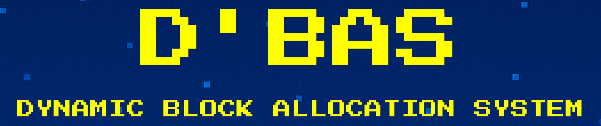
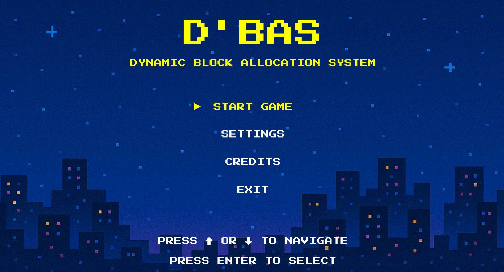
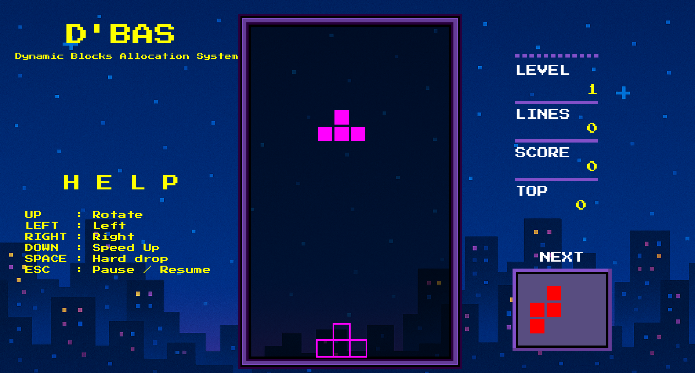
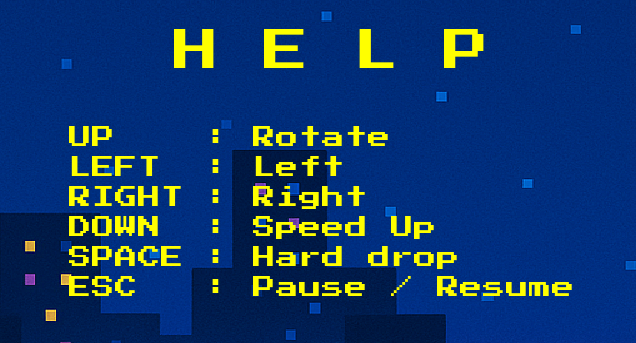

# Dynamic Block Allocation System (DBAS)



## 📖 Deskripsi Proyek

**Dynamic Block Allocation System** adalah sebuah permainan berbasis Java yang terinspirasi oleh permainan klasik Tetris. Pemain harus mengatur blok-blok yang jatuh (tetromino) untuk membentuk garis horizontal tanpa celah. Permainan ini dilengkapi dengan efek suara dan musik latar untuk meningkatkan pengalaman bermain.

## ✨ Fitur Utama

- 7 jenis tetromino berbeda dengan warna unik
- Sistem skor dan level yang progresif
- Efek suara interaktif dan musik latar yang imersif
- Mekanisme putar dan gerak blok yang intuitif
- Sistem pendeteksi tabrakan yang akurat
- Tampilan skor tertinggi
- Mode jeda untuk istirahat sementara

## 🖼️ Screenshot




## 🚀 Cara Menjalankan Program

### Persyaratan
Pastikan Anda memiliki Java Development Kit (JDK) terinstal di komputer Anda. Anda dapat mengunduhnya dari [situs resmi Oracle](https://www.oracle.com/java/technologies)

### Kompilasi
Buka terminal atau command prompt, navigasikan ke direktori proyek, dan jalankan perintah berikut untuk mengkompilasi semua file Java:
```bash
javac main/*.java mino/*.java
```

### Menjalankan Program
Setelah kompilasi selesai, jalankan program dengan perintah berikut:
```bash
java main.Main
```

## 🎮 Kontrol Permainan


### Kontrol Dasar
****
- **Tombol Panah Atas (↑)**: 
  - **Fungsi**: Memutar blok saat ini.
  - **Deskripsi**: Menekan tombol ini akan memutar blok ke arah yang sesuai, memungkinkan Anda untuk menyesuaikan posisi blok agar lebih cocok dengan ruang yang tersedia.

- **Tombol Panah Bawah (↓)**: 
  - **Fungsi**: Menurunkan blok saat ini.
  - **Deskripsi**: Menekan tombol ini akan membuat blok bergerak ke bawah satu langkah. Jika blok tidak menyentuh bagian bawah atau blok statis lainnya, blok akan turun.

- **Tombol Panah Kiri (←)**: 
  - **Fungsi**: Menggerakkan blok ke kiri.
  - **Deskripsi**: Menekan tombol ini akan memindahkan blok saat ini ke kiri satu langkah, selama tidak ada tabrakan dengan batas kiri atau blok statis lainnya.

- **Tombol Panah Kanan (→)**: 
  - **Fungsi**: Menggerakkan blok ke kanan.
  - **Deskripsi**: Menekan tombol ini akan memindahkan blok saat ini ke kanan satu langkah, selama tidak ada tabrakan dengan batas kanan atau blok statis lainnya.

- **Tombol Escape**: 
  - **Fungsi**: Menjeda dan melanjutkan permainan.
  - **Deskripsi**: Menekan tombol escape akan menghentikan permainan jika sedang berjalan. Jika permainan dijeda, menekan tombol escape lagi akan melanjutkan permainan.

- **Tombol Spasi**: 
  - **Fungsi**: Menurunkan blok secara langsung.
  - **Deskripsi**: Menekan tombol spasi akan membuat blok bergerak ke bawah secara langsung. Jika blok tidak menyentuh bagian bawah atau blok statis lainnya, blok akan turun.

## 🔍 Cara Bermain

1. Jalankan permainan sesuai instruksi di atas.
2. Blok akan mulai jatuh dari atas layar.
3. Gunakan tombol panah untuk menggerakkan dan memutar blok.
4. Tujuannya adalah membentuk garis horizontal tanpa celah.
5. Setiap garis yang terbentuk akan dihapus dan Anda mendapatkan poin.
6. Permainan berakhir ketika blok mencapai bagian atas layar.

## 🙏 Kredit

Inspirasi: **Tetris oleh Alexey Pajitnov**

---

**Dibuat dengan Kerja Keras**

**Terima kasih telah menggunakan Dynamic Block Allocation System! Barudak, Well!**
